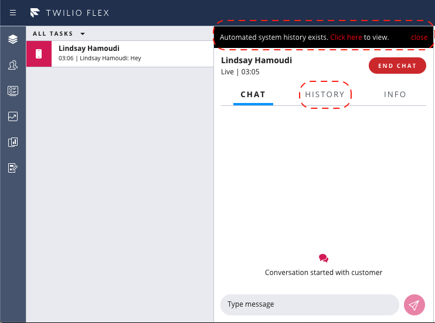
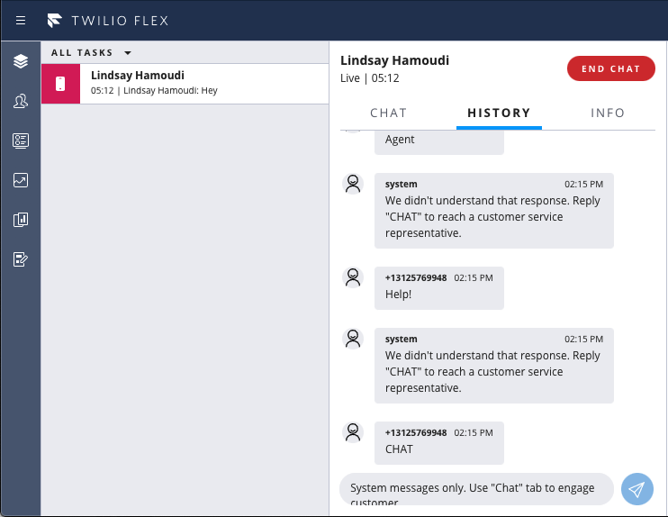

This repo provides a Flex UI 2.0 adaptation of the [Flex UI 1.x one provided by Twilio Professional Services](https://github.com/twilio-professional-services/plugin-chat-include-source-chat-channel.git)

# Flex Plugin to Include Source Chat Channel

This is a very basic Flex Chat plugin to read a `sourceChatChannelSid` task attribute, and render the message history (from that "source" chat conversation) in a separate "History" tab within the Task Canvas. The inputs on that "History" tab are disabled - since the agent is probably not a participant in that chat channel.

The use case here is when a chat task is created from another chat conversation - such as when a customer requests to chat to an agent via an otherwise automated chat conversation managed through a Studio flow, against a different Twilio phone number (say a short code), and where there's a need to give the agent immediate access to that other chat conversation for context. 

## Injecting the sourceChatChannelSid attribute

Refer to [this Professional Services repository](https://github.com/twilio-professional-services/function-flex-outbound-sms) for example functions and guidance for triggering a new chat task (well, SMS in this case) via a REST call (such as from the aforementioned Studio flow).

## Screenshots





## About Twilio Flex Plugins

Twilio Flex Plugins allow you to customize the appearance and behavior of [Twilio Flex](https://www.twilio.com/flex). If you want to learn more about the capabilities and how to use the API, check out our [Flex documentation](https://www.twilio.com/docs/flex).

## Setup

### Prerequisites

- [Node.js](https://nodejs.org) as well as [`npm`](https://npmjs.com). We support Node >= 10.12 and this repo was tested with v12.18.3
- [Flex Plugins CLI](https://www.twilio.com/docs/flex/developer/plugins/cli/install). This repo was built with version 5.2.0

## Development

In order to develop locally, you can use the Webpack Dev Server by running (from the root plugin directory):

```bash
twilio flex:plugins:start
```

This will automatically start up the Webpack Dev Server and open the browser for you. Your app will run on `http://localhost:3000`. If you want to change that you can do this by setting the `PORT` environment variable:

When you make changes to your code, the browser window will be automatically refreshed.

## Deploy

When you are ready to deploy your plugin, in your terminal run:
```
Run: 
twilio flex:plugins:deploy --major --changelog "Notes for this version" --description "Functionality of the plugin"
```
For more details on deploying your plugin, refer to the [deploying your plugin guide](https://www.twilio.com/docs/flex/plugins#deploying-your-plugin).

# Disclaimer

This software is to be considered "sample code", and is provided "as-is" to the user with no warranty or responsibility to support the use or implementation of this software.
